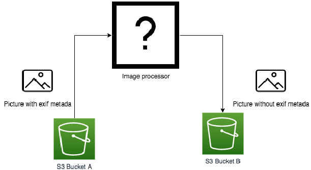

# GEL - Platform Engineer - AWS/Terraform/Python Test

## Requirements

Local development requires `docker` and `docker-compose` and AWS credentials
set in your environment.

You **must** have the proper environment variables defined before executing the commands.

* `AWS_SECRET_ACCESS_KEY`
* `AWS_ACCESS_KEY_ID`

On Windows
```
# Windows CMD
C:\> set VAR_NAME="VALUE"

# Windows PowerShell
C:\> $env:VAR_NAME="VALUE"
```

On macOS and Linux
```
export VAR_NAME="VALUE"
```

## Quick start

To create infrastructure and run a test in two commands:

```bash
docker-compose run dev apply   # Auto-applies infrastructure
docker-compose run test        # Runs a simple image upload to bucket_a and download from bucket_b
```

To destroy resources:

```bash
docker-compose run dev destroy
```

## Local development

Start a containerised development environment which includes `terraform`,
`python` and `aws-cli`:

```bash
docker-compose up -d
```

This will run the [`./bin/dev.sh`](./bin/dev.sh) script and install required
Python libraries to `lib/`.

Exec into the container:

```bash
docker-compose exec -it dev bash
```

Initialise the Terraform workspace.

```bash
terraform init
```

Run `terraform apply` or `terraform plan`:

```bash
terraform apply
```

## Assumptions, notes and decisions

To be discussed...

## The Task

~~Please complete this exercise within 2 days of receipt of this task~~. To share
your solution, send us a link to a repository on the platform of your choice
(GitHub, or GitLab, or Bitbucket, or something else). Please do not feel that
you have to spend the whole time on the exercise, we have allowed a longer time
to allow you to think on the method. There is no right or wrong answer to this,
we are interested in seeing your approach to the task.

### Step 1

A company allows their users to upload pictures to an S3 bucket. These pictures
are always in the .jpg format. The company wants these files to be stripped
from any exif metadata before being shown on their website. Pictures are
uploaded to an S3 bucket A.

Create a system that retrieves .jpg files when they are uploaded to the S3
bucket A, removes any exif metadata, and save them to another S3 bucket B. The
path of the files should be the same in buckets A and B



### Step 2

To extend this further, we have two users User A and User B. Create IAM users
with the following access:

- User A can Read/Write to Bucket A
- User B can Read from Bucket B
